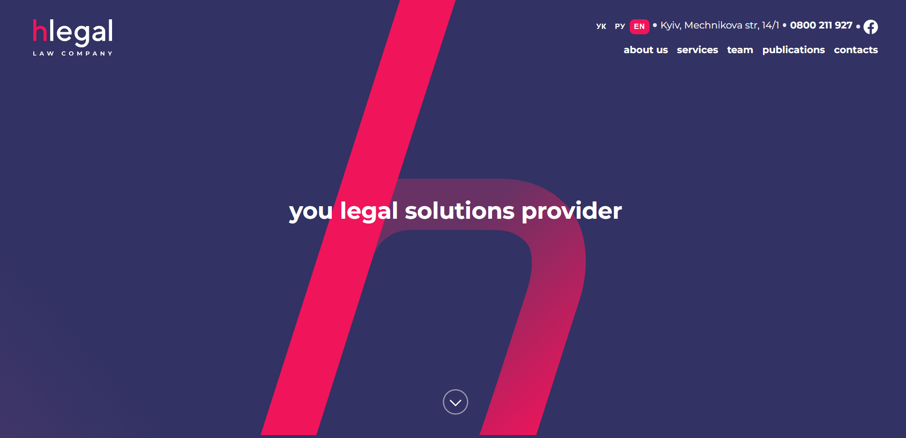
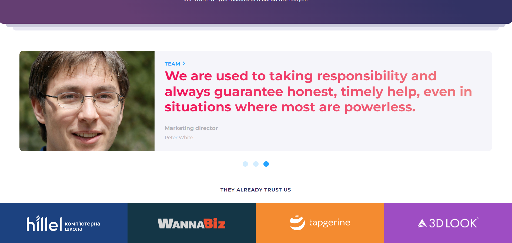

# Hlegals

This landing page for Hlegals law company is designed to showcase its services and expertise. It's built using HTML and SCSS, with a strong focus on responsive design and user-friendly navigation. 

## Features

- Fully responsive and adaptive design.
- Designed following the "Mobile First" approach.
- Smooth scrolling navigation with anchor links.
- Use of scss variables, mixins, placeholders and cycle.
- Carousel for "Team" section is created entirely using CSS without the need for JavaScript.
- Burger menu for mibile version is used for easy navigation

## Tech Stack

- HTML
- SCSS
- FontAwesome

## Access the App

You can access the application at the following link: [Hlegals](https://nataly-horbunova.github.io/hlegals/)

## Screenshots

## Getting Started

git clone https://github.com/Nataly-Horbunova/hlegals.git

cd hlegals
